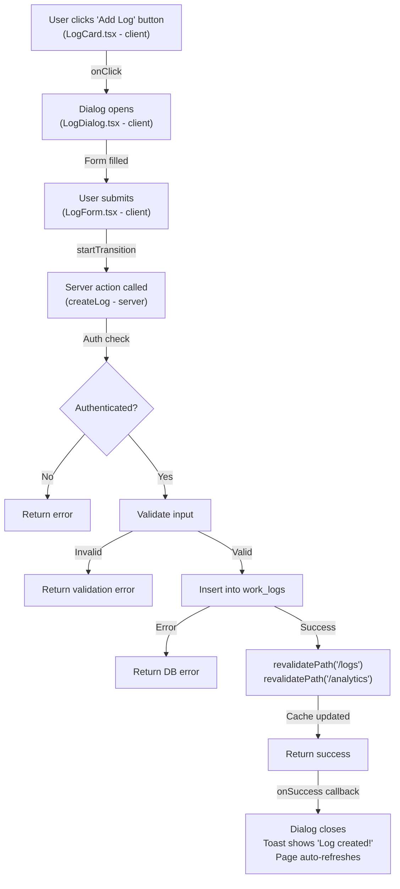

# Employee Worklog Tracker – Comprehensive Codebase Overview

> **Last Updated:** May 2026 | **Next.js Version:** 16.2.6 | **React Version:** 19.2.4

## 1. Project Structure & Architecture

### 1.1 Directory Layout

```
├── app/                          # Next.js App Router (server components by default)
│   ├── layout.tsx               # Root layout with fonts, toaster
│   ├── page.tsx                 # Landing/home page
│   ├── globals.css              # Global Tailwind directives
│   ├── (dashboard)/             # Protected layout group
│   │   ├── layout.tsx           # Dashboard shell (sidebar, topbar)
│   │   ├── page.tsx             # Dashboard home
│   │   ├── logs/                # Work logs feature
│   │   ├── analytics/           # Analytics dashboards
│   │   ├── settings/            # User settings
│   │   ├── projects/            # Project management
│   │   ├── users/               # User management (manager/admin)
│   │   ├── organisation/        # Organization mgmt (admin)
│   │   └── support/             # Support page
│   ├── auth/                    # Authentication pages (public)
│   │   ├── login/
│   │   ├── signup/
│   │   ├── change-password/
│   │   ├── reset-password/
│   │   └── callback/
│   ├── api/                     # API routes & webhooks
│   │   └── cron/insights/       # Scheduled insights generation
│   └── inactive/                # User inactive page
├── components/                  # Reusable React components
│   ├── ui/                      # shadcn/ui components (generated)
│   ├── auth/                    # Auth forms (LoginForm, SignupForm)
│   ├── layout/                  # Navigation (Sidebar, Topbar, MobileNav)
│   ├── logs/                    # Work log UI (LogForm, LogDialog, LogCard)
│   ├── analytics/               # Charts & stats
│   └── settings/                # Settings forms
├── lib/                         # Shared utilities & business logic
│   ├── server.ts                # Supabase server client factory
│   ├── client.ts                # Supabase browser client factory
│   ├── middleware.ts            # Next.js middleware (auth guard)
│   ├── types.ts                 # TypeScript interfaces (domain models)
│   ├── utils.ts                 # Helper functions (cn(), etc.)
│   ├── actions/                 # Server actions (mutations)
│   │   ├── auth.ts              # Sign in/up, password reset
│   │   ├── logs.ts              # Create/update/delete work logs
│   │   ├── projects.ts          # Project CRUD
│   │   ├── settings.ts          # User/profile updates
│   │   ├── organisation.ts      # Org management
│   │   └── insights.ts          # AI insights generation
│   └── queries/                 # Query functions (reads)
│       ├── logs.ts              # Fetch work logs
│       ├── analytics.ts         # Analytics data aggregation
│       ├── settings.ts          # User/profile data
│       ├── organisation.ts      # Org hierarchy queries
│       └── insights.ts          # Cached insights
├── supabase/                    # Database schema & migrations
│   ├── migration.sql            # Main schema + RLS policies
│   ├── projects_member_migration.sql
│   ├── department_migration.sql
│   └── insights_migration.sql
├── public/                      # Static assets (images, icons)
├── package.json                 # Dependencies & scripts
├── tsconfig.json                # TypeScript configuration
├── next.config.ts               # Next.js configuration
├── eslint.config.mjs            # Linting rules
├── postcss.config.mjs           # CSS processing
└── components.json              # shadcn CLI config
```

### 1.2 Architectural Layers

```
┌──────────────────────────────────────────────────────┐
│  FRONTEND (React 19 Components)                      │
│  - Server Components (default, data fetching)        │
│  - Client Components ('use client', interactivity)   │
│  - UI Components (shadcn/ui + Radix UI)             │
└──────────────────────────────────────────────────────┘
                           ↓
┌──────────────────────────────────────────────────────┐
│  DATA LAYER                                          │
│  - Query Functions (lib/queries/*.ts)                │
│  - Server Actions (lib/actions/*.ts)                 │
│  - Cache Invalidation (revalidatePath)               │
└──────────────────────────────────────────────────────┘
                           ↓
┌──────────────────────────────────────────────────────┐
│  SUPABASE (Backend)                                  │
│  - PostgreSQL Database                               │
│  - Auth (email/password + magic link)                │
│  - RLS Policies (role-based access control)          │
└──────────────────────────────────────────────────────┘
```

---

## 2. Technology Stack & Dependencies

### 2.1 Core Technologies

| Layer | Tech | Version | Purpose |
|-------|------|---------|---------|
| **Framework** | Next.js | 16.2.6 | Full-stack React framework with App Router |
| **UI Runtime** | React | 19.2.4 | Component library & hooks |
| **Language** | TypeScript | 5.x | Type safety |
| **Styling** | Tailwind CSS | 4 | Utility-first CSS |
| **Database** | Supabase (PostgreSQL) | Latest | Serverless backend + auth |
| **ORM/Query** | @supabase/supabase-js | 2.105.4 | Supabase client library |

### 2.2 Key Dependencies

```json
{
  "dependencies": {
    "next": "16.2.6",
    "react": "19.2.4",
    "react-dom": "19.2.4",
    "@supabase/ssr": "^0.10.3",           // SSR cookie handling
    "@supabase/supabase-js": "^2.105.4",  // Client + server API
    "tailwindcss": "^4",                  // Utility CSS
    "shadcn": "^4.7.0",                   // Component generator
    "radix-ui": "^1.4.3",                 // Accessible primitives
    "recharts": "^3.8.1",                 // Charts library
    "sonner": "^2.0.7",                   // Toast notifications
    "lucide-react": "^1.16.0",            // Icon library
    "next-themes": "^0.4.6",              // Dark mode support
    "embla-carousel-react": "^8.6.0",     // Carousel component
    "clsx": "^2.1.1",                     // Conditional classes
    "tailwind-merge": "^3.6.0"            // Merge Tailwind classes
  },
  "devDependencies": {
    "eslint": "^9",
    "eslint-config-next": "16.2.6",
    "@types/node": "^20",
    "@types/react": "^19",
    "@types/react-dom": "^19"
  }
}
```

### 2.3 Deployment & Build

- **Build Tool**: Next.js built-in bundler (esbuild)
- **Node Target**: ES2017 for broad compatibility
- **Output**: Static + Server-side Rendering (SSR) hybrid
- **Deployment**: Vercel (native Next.js support)

---

## 3. Key Conventions & Patterns

### 3.1 Import Path Aliases

```typescript
// tsconfig.json
{
  "paths": {
    "@/*": ["./*"]
  }
}

// Usage - ALWAYS use aliases for root-level imports
✅ import { cn } from "@/lib/utils"
✅ import { Button } from "@/components/ui/button"
❌ import { cn } from "../../../lib/utils"  // Avoid relative paths
```

### 3.2 File Organization

- **Pages**: `app/[layout]/[feature]/page.tsx`
- **Layouts**: `app/[layout]/layout.tsx` with metadata
- **Components**: `components/[category]/ComponentName.tsx`
- **UI Components**: `components/ui/[component].tsx` (generated by shadcn)
- **Queries**: `lib/queries/[domain].ts` (server-only data fetching)
- **Actions**: `lib/actions/[domain].ts` (server mutations)
- **Types**: `lib/types.ts` (all TypeScript interfaces)

### 3.3 Naming Conventions

- **Components**: PascalCase (`LogForm.tsx`, `DailyTrendChart.tsx`)
- **Functions**: camelCase (`getWorkLogs()`, `createLog()`)
- **Types/Interfaces**: PascalCase (`WorkLog`, `Profile`)
- **Constants**: UPPER_SNAKE_CASE (`CATEGORY_COLORS`, `CATEGORY_LABELS`)
- **CSS Classes**: Tailwind utility classes, merged with `cn()`

### 3.4 Component Classification

**Server Components** (default, no `'use client'`):
- All pages (`app/*/page.tsx`)
- Layout files (`layout.tsx`)
- Fetch data directly from Supabase
- Pass data as props to client components
- Examples: `LogsPage`, `AnalyticsPage`, `DashboardLayout`

**Client Components** (`'use client'` directive):
- Interactive features (forms, dialogs, filters)
- Use hooks: `useState()`, `useTransition()`, `useRouter()`
- Call server actions via `startTransition()`
- Examples: `LogForm`, `LogDialog`, `LogFilters`, `Sidebar`, `Topbar`

---

## 4. Development Patterns

### 4.1 Data Fetching (Server Components)

```typescript
// lib/queries/logs.ts
export async function getWorkLogs(filter: LogsFilter = {}): Promise<WorkLog[]> {
  const supabase = await createClient()
  
  let query = supabase
    .from('work_logs')
    .select('*, project(*), profile(*)')
    .order('date', { ascending: false })
  
  if (filter.userId) {
    query = query.eq('user_id', filter.userId)
  }
  
  const { data, error } = await query
  return data ?? []
}

// app/(dashboard)/logs/page.tsx (server component)
export default async function LogsPage() {
  const logs = await getWorkLogs({ userId: user.id })
  return <LogGroup logs={logs} />
}
```

**Key Points:**
- Query functions are in `lib/queries/*.ts`
- Always return typed data with fallback: `data ?? []`
- Use filter objects for flexible querying
- Queries are server-only by default

### 4.2 Mutations (Server Actions)

```typescript
// lib/actions/logs.ts
'use server'

export async function createLog(input: CreateLogInput) {
  const supabase = await createClient()
  const { data: { user } } = await supabase.auth.getUser()
  
  if (!user) return { error: 'Not authenticated' }
  
  // Server-side validation
  if (!input.date) return { error: 'Date is required' }
  
  const { error } = await supabase.from('work_logs').insert({
    user_id: user.id,
    date: input.date,
    hours: input.hours,
    category: input.category,
    description: input.description || null,
  })
  
  if (error) return { error: error.message }
  
  // ⚠️ CRITICAL: Revalidate affected routes
  revalidatePath('/logs')
  revalidatePath('/analytics')
  return { success: true }
}

// components/logs/LogForm.tsx (client component)
'use client'

export function LogForm({ projects }: LogFormProps) {
  const [isPending, startTransition] = useTransition()
  
  function handleSubmit(formData: FormData) {
    startTransition(async () => {
      const result = await createLog({ date: '...', hours: 8 })
      if (result.error) {
        toast.error(result.error)
      } else {
        toast.success('Log created!')
        onSuccess?.()
      }
    })
  }
  
  return (
    <form onSubmit={handleSubmit}>
      <button disabled={isPending}>
        {isPending ? 'Saving...' : 'Save'}
      </button>
    </form>
  )
}
```

**Key Points:**
- Server actions: `'use server'` directive at file top
- Always authenticate: `supabase.auth.getUser()`
- Validate on server before database queries
- Return typed results: `{ success: true }` or `{ error: string }`
- **Always call `revalidatePath()` after mutations** (critical!)
- Client calls via `useTransition()` for loading state

### 4.3 Authentication Flow

```typescript
// middleware.ts - Runs on every request
export async function updateSession(request: NextRequest) {
  const supabase = createServerClient(...)
  
  // ⚠️ CRITICAL: Always call getClaims() to refresh session
  const { data } = await supabase.auth.getClaims()
  const user = data?.claims
  
  // Redirect unauthenticated users to /auth/login
  if (!user && !request.nextUrl.pathname.startsWith('/auth')) {
    const url = request.nextUrl.clone()
    url.pathname = '/auth/login'
    return NextResponse.redirect(url)
  }
  
  return supabaseResponse
}

// lib/actions/auth.ts
export async function signIn(formData: FormData) {
  const email = formData.get('email') as string
  const password = formData.get('password') as string
  const supabase = await createClient()
  
  const { error } = await supabase.auth.signInWithPassword({ email, password })
  
  if (error) {
    return redirect(`/auth/login?error=${encodeURIComponent(error.message)}`)
  }
  
  revalidatePath('/', 'layout')
  redirect('/logs')
}
```

**Key Points:**
- Middleware auto-loads from `middleware.ts` at workspace root
- **`getClaims()` is critical** – refreshes session on each request
- Auth routes (`/auth/*`) are public; dashboard routes are protected
- Sign in/up handle redirects and cache invalidation

### 4.4 Role-Based Access Control (RBAC)

**Roles**: `'employee' | 'manager' | 'admin'`

```typescript
// Middleware: Allow any authenticated user
// Query Layer: Filter based on role
export async function getWorkLogs(filter: LogsFilter = {}) {
  const supabase = await createClient()
  const { data: { user } } = await supabase.auth.getUser()
  
  // For employees, only fetch own logs
  if (userRole === 'employee') {
    query = query.eq('user_id', user.id)
  }
  // For managers, fetch team logs
  else if (userRole === 'manager') {
    const teamIds = await getTeamMemberIds(user.id)
    query = query.in('user_id', teamIds)
  }
  // For admins, fetch all logs
  
  return data
}

// Database: RLS policies enforce permissions
CREATE POLICY "work_logs_select"
  ON public.work_logs FOR SELECT
  USING (
    user_id = auth.uid()
    OR
    (SELECT role FROM public.profiles WHERE id = auth.uid()) IN ('manager', 'admin')
  );
```

**Key Points:**
- Roles stored in `profiles.role`
- Middleware allows authenticated access; queries filter by role
- RLS policies in database enforce final layer of security
- Three-tier permission model: app middleware → query filters → RLS

---

## 5. Database Schema

### 5.1 Tables & Relationships

```sql
-- 1. PROFILES (extends auth.users)
CREATE TABLE profiles (
  id UUID PRIMARY KEY REFERENCES auth.users(id) ON DELETE CASCADE,
  full_name TEXT,
  avatar_url TEXT,
  email TEXT,
  role TEXT DEFAULT 'employee' CHECK (role IN ('employee', 'manager', 'admin')),
  weekly_goal INTEGER DEFAULT 40 CHECK (weekly_goal BETWEEN 1 AND 168),
  department_id UUID REFERENCES departments(id),
  is_active BOOLEAN DEFAULT true,
  requires_password_change BOOLEAN DEFAULT false,
  created_at TIMESTAMPTZ DEFAULT now(),
  updated_at TIMESTAMPTZ DEFAULT now()
);

-- 2. DEPARTMENTS (organizational hierarchy)
CREATE TABLE departments (
  id UUID PRIMARY KEY DEFAULT gen_random_uuid(),
  name TEXT NOT NULL UNIQUE,
  code TEXT NOT NULL UNIQUE,
  manager_id UUID REFERENCES profiles(id) ON DELETE SET NULL,
  color TEXT NOT NULL DEFAULT '#4f46e5',
  is_active BOOLEAN DEFAULT true,
  created_at TIMESTAMPTZ DEFAULT now(),
  updated_at TIMESTAMPTZ DEFAULT now()
);

-- 3. PROJECTS (company-wide billable projects)
CREATE TABLE projects (
  id UUID PRIMARY KEY DEFAULT gen_random_uuid(),
  name TEXT NOT NULL UNIQUE,
  color TEXT NOT NULL DEFAULT '#4f46e5',
  is_active BOOLEAN DEFAULT true,
  created_by UUID REFERENCES profiles(id) ON DELETE SET NULL,
  department_id UUID REFERENCES departments(id) ON DELETE SET NULL,
  created_at TIMESTAMPTZ DEFAULT now(),
  updated_at TIMESTAMPTZ DEFAULT now()
);

-- 4. PROJECT_MEMBERS (junction table for many-to-many)
CREATE TABLE project_members (
  id UUID PRIMARY KEY DEFAULT gen_random_uuid(),
  project_id UUID NOT NULL REFERENCES projects(id) ON DELETE CASCADE,
  user_id UUID NOT NULL REFERENCES profiles(id) ON DELETE CASCADE,
  created_at TIMESTAMPTZ DEFAULT now(),
  UNIQUE(project_id, user_id)
);

-- 5. WORK_LOGS (time entries)
CREATE TABLE work_logs (
  id UUID PRIMARY KEY DEFAULT gen_random_uuid(),
  user_id UUID NOT NULL REFERENCES profiles(id) ON DELETE CASCADE,
  project_id UUID REFERENCES projects(id) ON DELETE SET NULL,
  date DATE NOT NULL,
  hours NUMERIC(5,2) NOT NULL CHECK (hours > 0 AND hours <= 24),
  category TEXT NOT NULL CHECK (category IN (
    'on_project', 'shadow', 'bench', 'leave', 'training', 'other_project_support'
  )),
  description TEXT,
  created_at TIMESTAMPTZ DEFAULT now(),
  updated_at TIMESTAMPTZ DEFAULT now()
);

-- 6. INSIGHTS (cached AI-generated insights)
CREATE TABLE insights (
  id UUID PRIMARY KEY DEFAULT gen_random_uuid(),
  user_id UUID NOT NULL REFERENCES profiles(id) ON DELETE CASCADE,
  insight TEXT NOT NULL,
  type TEXT DEFAULT 'productivity',
  created_at TIMESTAMPTZ DEFAULT now(),
  UNIQUE(user_id, created_at::date)  -- One insight per user per day
);
```

### 5.2 Key Indexes

```sql
CREATE INDEX idx_work_logs_user_date ON work_logs (user_id, date DESC);
CREATE INDEX idx_work_logs_date ON work_logs (date DESC);
```

### 5.3 Row Level Security (RLS)

- **profiles**: Users can read all profiles; update only their own
- **projects**: All authenticated users can read; only admins can modify
- **work_logs**: 
  - Employees see only their own logs
  - Managers/admins see all logs
  - Users can only insert/update/delete their own
  - Admins can delete any

### 5.4 Work Log Categories

| Category | Purpose | Color |
|----------|---------|-------|
| **on_project** | Active billable work | #4f46e5 (blue) |
| **shadow** | Learning from peers | #8b5cf6 (purple) |
| **bench** | Awaiting assignment | #f59e0b (amber) |
| **leave** | Vacation/sick/PTO | #ef4444 (red) |
| **training** | Professional development | #22c55e (green) |
| **other_project_support** | Internal team support | #06b6d4 (cyan) |

---

## 6. Common Gotchas & Solutions

### ❌ 6.1 Using Relative Imports for Root-Level Code

**WRONG:**
```typescript
import { cn } from "../../../lib/utils"
import { Button } from "../../../components/ui/button"
```

**CORRECT:**
```typescript
import { cn } from "@/lib/utils"
import { Button } from "@/components/ui/button"
```

**Why?** Path aliases are configured in `tsconfig.json`. Relative imports cause build failures.

---

### ❌ 6.2 Forgetting `revalidatePath()` After Mutations

**WRONG:**
```typescript
export async function createLog(input: CreateLogInput) {
  const supabase = await createClient()
  await supabase.from('work_logs').insert({...})
  return { success: true }  // ❌ Cache not invalidated
}
```

**CORRECT:**
```typescript
export async function createLog(input: CreateLogInput) {
  const supabase = await createClient()
  await supabase.from('work_logs').insert({...})
  revalidatePath('/logs')      // ✅ Refresh page cache
  revalidatePath('/analytics') // ✅ Refresh analytics
  return { success: true }
}
```

**Why?** Next.js caches server component renders. Without revalidation, UI won't reflect database changes.

---

### ❌ 6.3 Using `useSearchParams()` Without Suspense

**WRONG:**
```typescript
'use client'
export function FilterComponent() {
  const searchParams = useSearchParams()  // ❌ Will error
  return <div>{searchParams.get('filter')}</div>
}
```

**CORRECT:**
```typescript
'use client'
import { Suspense } from 'react'

function FilterComponentInner() {
  const searchParams = useSearchParams()
  return <div>{searchParams.get('filter')}</div>
}

export function FilterComponent() {
  return (
    <Suspense fallback={<div>Loading...</div>}>
      <FilterComponentInner />
    </Suspense>
  )
}
```

**Why?** `useSearchParams()` requires a Suspense boundary in Next.js 16 App Router.

---

### ❌ 6.4 Calling Server Actions Without `useTransition()`

**WRONG:**
```typescript
'use client'
export function LogForm() {
  async function handleSubmit() {
    const result = await createLog({...})  // Can't show loading state
  }
}
```

**CORRECT:**
```typescript
'use client'
import { useTransition } from 'react'

export function LogForm() {
  const [isPending, startTransition] = useTransition()
  
  function handleSubmit() {
    startTransition(async () => {
      const result = await createLog({...})
    })
  }
  
  return (
    <button disabled={isPending}>
      {isPending ? 'Saving...' : 'Save'}
    </button>
  )
}
```

**Why?** `useTransition()` provides `isPending` state for loading UI and form disabling.

---

### ❌ 6.5 Putting Supabase Client in Global Variables

**WRONG:**
```typescript
// lib/client.ts
const supabase = createBrowserClient(...)
export { supabase }  // ❌ Shared instance
```

**CORRECT:**
```typescript
// lib/client.ts
export function createClient() {
  return createBrowserClient(...)  // ✅ Fresh instance per call
}
```

**Why?** Supabase clients with Fluid Compute may share state across requests.

---

### ❌ 6.6 Using Browser Client in Server Actions

**WRONG:**
```typescript
'use server'
import { createClient } from '@/lib/client'

export async function createLog(input: CreateLogInput) {
  const supabase = createClient()  // ❌ Browser client
  await supabase.from('work_logs').insert({...})
}
```

**CORRECT:**
```typescript
'use server'
import { createClient } from '@/lib/server'

export async function createLog(input: CreateLogInput) {
  const supabase = await createClient()  // ✅ Server client
  await supabase.from('work_logs').insert({...})
}
```

**Why?** Browser clients use `localStorage` (unavailable on server). Server actions need server clients.

---

### ❌ 6.7 Missing `getClaims()` in Middleware

**WRONG:**
```typescript
export async function updateSession(request: NextRequest) {
  const supabase = createServerClient(...)
  // Missing getClaims() call
  return supabaseResponse
}
```

**CORRECT:**
```typescript
export async function updateSession(request: NextRequest) {
  const supabase = createServerClient(...)
  
  // ⚠️ CRITICAL: Always call getClaims()
  const { data } = await supabase.auth.getClaims()
  const user = data?.claims
  
  // ... rest of logic
  return supabaseResponse
}
```

**Why?** Without `getClaims()`, session cookies won't refresh, causing random logouts.

---

## 7. Configuration Files

### 7.1 TypeScript (`tsconfig.json`)

```json
{
  "compilerOptions": {
    "target": "ES2017",                    // Modern JS target
    "strict": true,                        // Full type safety
    "module": "esnext",
    "moduleResolution": "bundler",         // Next.js bundler resolution
    "jsx": "react-jsx",                    // React 19 JSX transform
    "paths": {
      "@/*": ["./*"]                       // Path aliases
    }
  }
}
```

### 7.2 Next.js (`next.config.ts`)

```typescript
const nextConfig: NextConfig = {
  allowedDevOrigins: ['192.168.1.7'],      // Local dev IP
  images: {
    remotePatterns: [
      {
        protocol: 'https',
        hostname: 'www.teqfocus.com',      // Allow Teqfocus images
        pathname: '/**',
      },
    ],
  },
};
```

### 7.3 Tailwind CSS (`tailwind.config.*`)

- **Version**: 4.x with `@tailwindcss/postcss`
- **Theme**: CSS variables for dark mode support (`next-themes`)
- **Plugins**: shadcn components auto-register

### 7.4 ESLint (`eslint.config.mjs`)

```javascript
const eslintConfig = defineConfig([
  ...nextVitals,           // Next.js core web vitals
  ...nextTs,               // TypeScript support
  globalIgnores([
    ".next/**",
    "out/**",
    "build/**",
  ]),
]);
```

---

## 8. Testing & Linting

### 8.1 Linting

**Command**: `npm run lint`

**Configuration**:
- ESLint 9 with Next.js core web vitals rules
- TypeScript support via `@types/` packages
- No auto-fix; requires manual correction

**What's Checked**:
- TypeScript type errors
- Unused variables
- React hook rules
- Next.js best practices

### 8.2 Testing

**Current State**: No testing framework configured

**Recommendations**:
- **Unit Tests**: Jest + React Testing Library
- **E2E Tests**: Playwright or Cypress
- **Type Testing**: TypeScript compiler in strict mode

---

## 9. Deployment & CI/CD

### 9.1 Build Process

```bash
npm run build    # Compiles TypeScript, bundles with esbuild, optimizes
npm run start    # Runs production server (requires npm run build first)
npm run dev      # Development server with HMR on port 3000
```

### 9.2 Build Output

- Optimization via Next.js internal bundler
- Static pages + API routes in `.next/` directory
- Source maps included for debugging

### 9.3 Environment Setup

**Required Variables** (in `.env.local`):

```
NEXT_PUBLIC_SUPABASE_URL=https://[project-id].supabase.co
NEXT_PUBLIC_SUPABASE_PUBLISHABLE_KEY=your_key_here
```

**Why Public?**
- Browser client needs access to initialize
- No sensitive auth logic exposed

### 9.4 Vercel Deployment

The project is optimized for Vercel:
- Native Next.js support
- Automatic function extraction
- Edge middleware support
- Instant rollback capability

**Deploy Command**:
```bash
vercel deploy
```

---

## 10. Feature Patterns by Domain

### 10.1 Work Logs

| Task | Location | Function | Pattern |
|------|----------|----------|---------|
| Create log | `lib/actions/logs.ts` | `createLog()` | Server action + form |
| Update log | `lib/actions/logs.ts` | `updateLog()` | Server action + dialog |
| Delete log | `lib/actions/logs.ts` | `deleteLog()` | Server action + button |
| Fetch logs | `lib/queries/logs.ts` | `getWorkLogs()` | Query + page component |
| Display logs | `components/logs/LogGroup.tsx` | Render grouped by date | Server component |
| Edit log | `components/logs/LogForm.tsx` | Form with `useTransition()` | Client component |

### 10.2 Analytics

| Metric | Function | Location | Aggregation |
|--------|----------|----------|-------------|
| Daily trend | `getDailyTrend()` | `lib/queries/analytics.ts` | Group by date, sum hours |
| Category split | `getCategorySplit()` | `lib/queries/analytics.ts` | Group by category |
| Project hours | `getProjectHours()` | `lib/queries/analytics.ts` | Group by project |
| Weekly total | `getWeeklyHours()` | `lib/queries/settings.ts` | Filter date range |

### 10.3 User Management

| Action | Function | Location | Scope |
|--------|----------|----------|-------|
| Get profile | `getProfile()` | `lib/queries/settings.ts` | Single user |
| Update profile | `updateProfile()` | `lib/actions/settings.ts` | Own profile only |
| Get team members | `getProfilesForManager()` | `lib/queries/settings.ts` | Manager's team |
| Admin: Get all users | `getAllProfiles()` | `lib/queries/settings.ts` | All profiles |

### 10.4 Authentication

| Action | Function | Location | Behavior |
|--------|----------|----------|----------|
| Sign in | `signIn()` | `lib/actions/auth.ts` | Form → redirect to /logs |
| Sign up | `signUp()` | `lib/actions/auth.ts` | Form → redirect to /login |
| Sign out | `signOut()` | `lib/actions/auth.ts` | Clears session → /login |
| Reset password | `checkEmailAndSendResetLink()` | `lib/actions/auth.ts` | Email verification flow |

---

## 11. Component Interaction Example

### Typical User Flow: Create Work Log



---

## 12. Quick Reference: When to Use What

### 12.1 Page Component Pattern

```typescript
// app/(dashboard)/logs/page.tsx
import { createClient } from '@/lib/server'
import { getWorkLogs } from '@/lib/queries/logs'

export const metadata: Metadata = { title: 'Work Logs' }

export default async function LogsPage({
  searchParams,
}: {
  searchParams: Promise<{ month?: string }>
}) {
  const supabase = await createClient()
  const { data: { user } } = await supabase.auth.getUser()
  
  if (!user) redirect('/auth/login')
  
  const logs = await getWorkLogs({ userId: user.id })
  
  return (
    <div>
      <LogFilters />          {/* client component */}
      <LogGroup logs={logs} /> {/* server component with data props */}
    </div>
  )
}
```

### 12.2 Client Component with Form Pattern

```typescript
// components/logs/LogForm.tsx
'use client'

import { useTransition } from 'react'
import { createLog } from '@/lib/actions/logs'

export function LogForm({ projects }: LogFormProps) {
  const [isPending, startTransition] = useTransition()
  
  function handleSubmit(formData: FormData) {
    startTransition(async () => {
      const result = await createLog({
        date: formData.get('date'),
        hours: parseFloat(formData.get('hours')),
        // ...
      })
      
      if (result.error) {
        toast.error(result.error)
      } else {
        toast.success('Created!')
        onSuccess?.()
      }
    })
  }
  
  return <form onSubmit={handleSubmit}>...</form>
}
```

### 12.3 Query Function Pattern

```typescript
// lib/queries/logs.ts
import { createClient } from '@/lib/server'

export async function getWorkLogs(
  filter: LogsFilter = {}
): Promise<WorkLog[]> {
  const supabase = await createClient()
  
  let query = supabase
    .from('work_logs')
    .select('*, project(*), profile(*)')
    .order('date', { ascending: false })
  
  if (filter.userId) {
    query = query.eq('user_id', filter.userId)
  }
  if (filter.startDate) {
    query = query.gte('date', filter.startDate)
  }
  
  const { data, error } = await query
  return data ?? []  // Always return array with fallback
}
```

### 12.4 Server Action Pattern

```typescript
// lib/actions/logs.ts
'use server'

import { createClient } from '@/lib/server'
import { revalidatePath } from 'next/cache'

export async function createLog(input: CreateLogInput) {
  // 1. Authenticate
  const supabase = await createClient()
  const { data: { user } } = await supabase.auth.getUser()
  if (!user) return { error: 'Not authenticated' }
  
  // 2. Validate
  if (!input.date) return { error: 'Date required' }
  if (input.hours <= 0) return { error: 'Invalid hours' }
  
  // 3. Mutate
  const { error } = await supabase.from('work_logs').insert({
    user_id: user.id,
    date: input.date,
    hours: input.hours,
    category: input.category,
  })
  
  if (error) return { error: error.message }
  
  // 4. Revalidate
  revalidatePath('/logs')
  revalidatePath('/analytics')
  
  return { success: true }
}
```

---

## 13. Learning Path for New Developers

1. **Setup**: Follow `.env.local` + `npm install` + `npm run dev`
2. **Architecture**: Read AGENTS.md (file organization + patterns)
3. **Database**: Review `supabase/migration.sql` (schema + RLS)
4. **Examples**: Study `app/(dashboard)/logs/page.tsx` + `components/logs/LogForm.tsx`
5. **Add Feature**: Create new page following patterns from existing pages
6. **Debug**: Check Next.js terminal for server errors, browser DevTools for client errors

---

## 14. External Resources

| Resource | Link | Use Case |
|----------|------|----------|
| Next.js 16 Docs | https://nextjs.org/docs | App Router, metadata, middleware |
| React 19 Docs | https://react.dev | Hooks, Server Components, transitions |
| Supabase Docs | https://supabase.com/docs | Auth, database, RLS |
| shadcn/ui | https://ui.shadcn.com | Component library |
| Tailwind CSS | https://tailwindcss.com | Styling utilities |
| Radix UI | https://www.radix-ui.com | Accessible primitives |
| Vercel Docs | https://vercel.com/docs | Deployment, edge functions |

---

**End of Codebase Overview**
